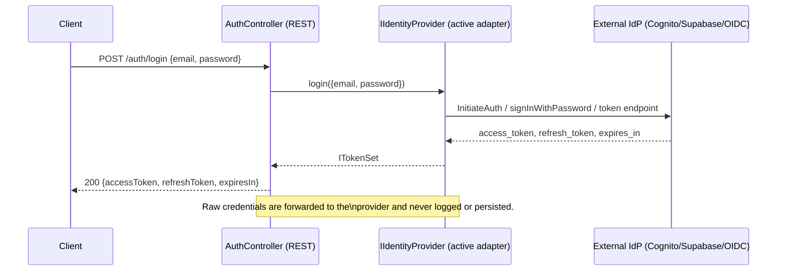
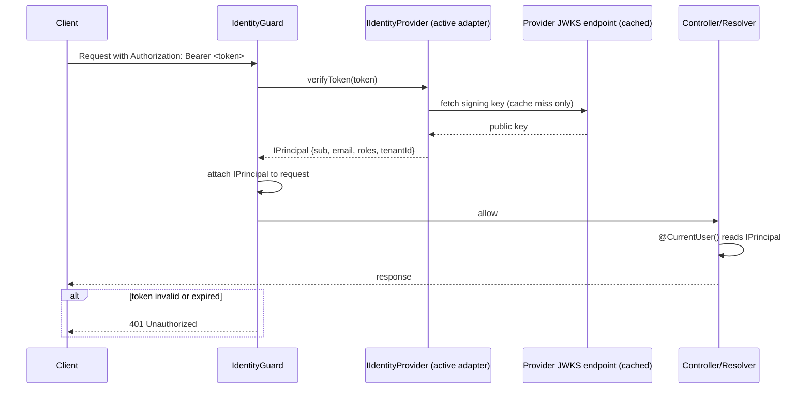

# Design: core identity module

## Layout

`src/core/identity/` follows the same domain/application/infrastructure/
transport split the architecture skill mandates for bounded contexts, even
though this is core infrastructure rather than a bounded context — there is
no aggregate, no persistence, and no `{context}.module.ts` registration in
`CONTEXT_MODULES` (it is wired directly into `CORE_MODULES` instead).

```
src/core/identity/
├── domain/
│   └── enums/
│       └── role.enum.ts                      — Role enum (shared, provider-agnostic)
├── application/
│   ├── ports/
│   │   ├── identity-provider.port.ts          — IIdentityProvider interface + DI token (Symbol)
│   │   ├── principal.interface.ts             — IPrincipal
│   │   ├── token-set.interface.ts             — ITokenSet
│   │   ├── login-credentials.interface.ts     — ILoginCredentials
│   │   └── user-attributes.interface.ts       — IUserAttributes (create/update payload)
│   └── services/
│       └── identity-provider.factory.ts       — useFactory resolving the active adapter from IDENTITY_PROVIDER
├── infrastructure/
│   ├── providers/
│   │   ├── cognito/
│   │   │   ├── cognito-identity.provider.ts
│   │   │   └── cognito-claims.mapper.ts       — raw Cognito claims -> IPrincipal
│   │   ├── supabase/
│   │   │   ├── supabase-identity.provider.ts
│   │   │   └── supabase-claims.mapper.ts
│   │   └── oidc/
│   │       ├── oidc-identity.provider.ts
│   │       └── oidc-claims.mapper.ts
│   ├── guards/
│   │   ├── identity.guard.ts                  — verifies bearer token, attaches IPrincipal to request
│   │   └── roles.guard.ts                     — checks IPrincipal.roles against @Roles() metadata
│   └── decorators/
│       ├── current-user.decorator.ts          — @CurrentUser()
│       └── roles.decorator.ts                 — @Roles(...roles: Role[])
├── transport/
│   └── rest/
│       ├── auth.controller.ts                 — POST /auth/login, POST /auth/refresh
│       └── dtos/
│           ├── login.dto.ts
│           └── refresh-token.dto.ts
└── identity.module.ts
```

`identity.module.ts` follows the repo's named-array convention:

```ts
const IDENTITY_PROVIDERS = [
  { provide: IDENTITY_PROVIDER_TOKEN, useFactory: identityProviderFactory, inject: [ConfigService] },
];
const INFRASTRUCTURE_GUARDS = [IdentityGuard, RolesGuard];
const TRANSPORT_PROVIDERS = [AuthController];

@Module({
  imports: [ConfigModule],
  providers: [...IDENTITY_PROVIDERS, ...INFRASTRUCTURE_GUARDS],
  controllers: [...TRANSPORT_PROVIDERS],
  exports: [IDENTITY_PROVIDER_TOKEN, IdentityGuard, RolesGuard],
})
export class IdentityModule {}
```

## Decisions

1. **`core/`, not `contexts/`.** The module owns no aggregate and persists
   nothing — the IdP is the system of record for users. Per the
   architecture skill, business logic and aggregates belong in
   `src/contexts/`; this is cross-cutting infrastructure, matching the
   README's documented (but previously unimplemented) extension point.

2. **Port + adapter per provider, not a single class with branching.** Each
   provider's SDK (`@aws-sdk/client-cognito-identity-provider`,
   `@supabase/supabase-js`, `openid-client`) is isolated inside its own
   adapter. Adding a fourth provider later means adding one adapter file and
   one factory branch — it never touches Cognito's or Supabase's code, and
   each adapter is unit-testable against a mocked SDK client independently.

3. **One active provider per deployment, resolved at boot.** `IDENTITY_PROVIDER`
   is read once via the same `registerAs`/Zod-validated pattern already used
   by `postgres.config.ts` and `env.validation.ts`. The factory throws at
   startup (not at first request) if the selected provider's required env
   vars are missing — consistent with the existing `KAFKA_ENABLED` ->
   `KAFKA_BROKERS` fail-fast pattern in `env.validation.ts`.

4. **Claims normalization is provider-owned, not guard-owned.** `IdentityGuard`
   never inspects raw claims — it calls `IIdentityProvider.verifyToken()` and
   gets back an already-normalized `IPrincipal`. Each adapter's
   `*-claims.mapper.ts` is the only place that knows about
   `cognito:groups` vs `app_metadata.roles` vs a configurable OIDC role
   claim name.

5. **REST-only for login/refresh.** `POST /auth/login` and `POST /auth/refresh`
   accept credential-shaped payloads; keeping them out of the GraphQL schema
   avoids putting a password field in the Apollo schema and matches how
   mobile/service-to-service clients typically consume auth endpoints.
   `IdentityGuard`/`RolesGuard` themselves are transport-agnostic and apply
   equally to REST, GraphQL, and MCP.

6. **MCP `contextBuilder` gets the principal, but does not enforce auth.**
   `McpModule.forRoot({ ..., contextBuilder })` resolves an `IPrincipal` from
   the incoming request's bearer token (if present) and attaches it to
   `IMcpToolContext`, mirroring `@CurrentUser()`. Enforcing that a given tool
   *requires* a principal is left to that tool (or a future
   `RolesGuard`-equivalent for MCP) — no MCP tools exist yet in this
   template that need it, so this change only wires the plumbing.

7. **No local user persistence.** `createUser`/`updateUserAttributes`/etc.
   delegate straight to the provider's admin API and return whatever the
   provider returns. If a service later needs an app-local profile (roles
   beyond what the IdP tracks, preferences, ...), that becomes its own
   bounded context that treats this module's `IPrincipal.sub` as a foreign
   identifier — this change does not build that context.

## Sequence: backend-proxied login



## Sequence: authenticated request (REST/GraphQL) via IdentityGuard



## Alternatives considered

- **Client-side-only auth** (client talks to the IdP directly, backend only
  verifies) — rejected: the discussion with the requester explicitly chose
  backend-proxied login.
- **Multi-provider-simultaneous / per-tenant IdP selection** — rejected for
  v1: adds a strategy registry and per-request issuer resolution with no
  current requirement driving it. One provider per deployment, selected via
  env var, is the chosen v1 shape; multi-tenant can be layered on top of the
  same `IIdentityProvider` port later without breaking it.
  A `role.enum.ts` that is a global superset of every provider's real roles
  keeps `RolesGuard` provider-agnostic without leaking provider claim shapes
  into `src/contexts/`.

## Follow-ups (explicitly out of scope here)

- Rate limiting / brute-force protection on `POST /auth/login`.
- A dedicated local/dev fake `IIdentityProvider` adapter (tests instead use
  a mocked port).
- Per-tool MCP authorization (requiring specific roles for specific tools).
