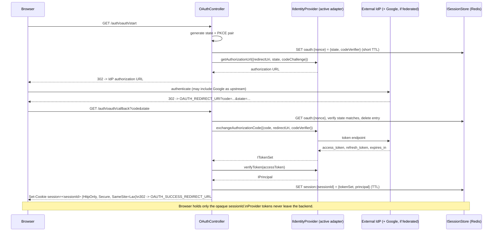
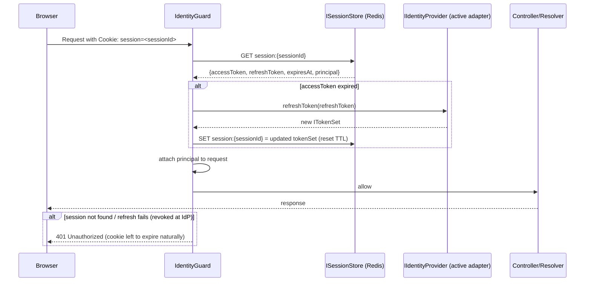

# Design: OAuth/social login via a BFF session

## Decided: session store — Redis

**Resolved: Redis.** This was flagged explicitly because it is the one new
piece of infrastructure this change requires either way, and the repo
currently has none (`docker-compose.yml` ships only Postgres + the OTel
collector; `package.json` has no `ioredis`, no `connect-redis`, nothing
session-shaped) — confirmed with the requester before implementation.

| | Redis (proposed) | Postgres (`session` table) |
|---|---|---|
| TTL / auto-expiry | Native (`EX` on `SET`), zero cleanup code | No native TTL — needs a cron/scheduled `DELETE WHERE expires_at < now()` or every read pays a "is this still valid" check |
| Write pattern | In-memory, sub-ms; sessions are read on every authenticated request and written on every silent token refresh — high churn | Adds write load to the same database serving the app's actual business data; each refresh is a row `UPDATE` |
| Horizontal scaling | Built for this — any backend instance reads the same store | Works too (Postgres is already shared), but competes for connections/IO with everything else in `src/contexts/` |
| New infra | Yes — new service to run/monitor in every environment cloned from this template | No — reuses the Postgres this template already requires |
| Ops cost for a template | Every service built from this template that enables OAuth login now needs Redis in every environment (dev, CI, staging, prod) | Zero extra ops — the DB is already a hard requirement |

Redis is the standard choice for this exact workload (this is what
"session store" means in most production BFF write-ups), and is what this
design assumes throughout — confirmed as the choice to implement. The
`ISessionStore` port keeps a Postgres-backed adapter possible later without
touching anything else in this design, but only the Redis adapter ships in
this change.

## Layout

Extends `src/core/identity/` rather than adding a new top-level module —
this is the same cross-cutting identity concern `add-core-identity-module`
already owns, just a second way to authenticate.

```
src/core/identity/
├── application/
│   ├── ports/
│   │   ├── identity-provider.port.ts          — EXTENDED: + getAuthorizationUrl(), + exchangeAuthorizationCode()
│   │   ├── authorization-url-options.interface.ts   — NEW: { redirectUri, state, codeChallenge }
│   │   ├── authorization-code-exchange.interface.ts — NEW: { code, redirectUri, codeVerifier }
│   │   └── session-store.port.ts              — NEW: ISessionStore interface + DI token
│   └── services/
│       └── oauth-state.service.ts             — NEW: generates/validates PKCE + state, short-lived (its own Redis key, separate from the session itself)
├── infrastructure/
│   ├── providers/
│   │   ├── cognito/cognito-identity.provider.ts    — EXTENDED (Hosted UI authorize/token endpoints)
│   │   ├── supabase/supabase-identity.provider.ts  — EXTENDED (signInWithOAuth / exchangeCodeForSession)
│   │   └── oidc/oidc-identity.provider.ts          — EXTENDED (openid-client authorization-code helpers)
│   ├── session/
│   │   └── redis-session.store.ts             — NEW: ISessionStore implementation (or postgres-session.store.ts — see open question above)
│   └── guards/
│       └── identity.guard.ts                  — EXTENDED: resolve IPrincipal from session cookie, falling back to Authorization header
└── transport/
    └── rest/
        ├── oauth.controller.ts                — NEW: GET /auth/oauth/start, GET /auth/oauth/callback, POST /auth/logout
        └── auth.controller.ts                 — UNCHANGED: POST /auth/login, POST /auth/refresh
```

## Decisions

1. **Extend the existing `IIdentityProvider` port, don't add a parallel
   abstraction.** `getAuthorizationUrl()`/`exchangeAuthorizationCode()`
   join `login`/`refreshToken`/`verifyToken` on the same port, resolved by
   the same `identity-provider.factory.ts`. A future fourth provider
   implements all five methods in one adapter file, same as today.

2. **`IdentityGuard` gets one new resolution path, not a second guard.**
   Requiring services to remember "use `IdentityGuard` for bearer routes,
   `SessionGuard` for cookie routes" on every controller is exactly the
   footgun a BFF is supposed to remove for the frontend — no reason to
   reintroduce it for backend route authors. `IdentityGuard.canActivate()`
   tries the session cookie first (if `OAUTH_SESSION_ENABLED` and the
   cookie is present), falls back to `Authorization: Bearer`, and attaches
   the same `IPrincipal` shape either way — `@CurrentUser()` and
   `RolesGuard` don't know or care which path resolved it.

3. **Silent refresh lives in the guard's cookie path, not a separate
   endpoint.** Mirrors why `add-core-identity-module` put claims
   normalization in the provider, not the guard: the guard already owns
   "is this request's identity currently valid," so "refresh it if it
   silently expired" belongs there too, next to where the expiry is
   noticed — not in a `POST /auth/refresh`-shaped endpoint the frontend
   would need to call proactively, which is exactly the coordination this
   whole change exists to remove.

4. **PKCE `state`/`code_verifier` get their own short-lived store entry,
   not reused session infrastructure conceptually.** They exist for the
   ~seconds between `GET /auth/oauth/start` and the callback, are
   single-use, and must be gone before a real session exists — a very
   different lifecycle from an authenticated session (minutes-to-hours,
   refreshed, tied to a principal). Implemented as a short-TTL key in the
   same store (`ISessionStore`'s backing store, different key prefix and
   TTL) rather than a second store, since the storage mechanics are
   identical either way (Redis or Postgres, whichever the open question
   above resolves to).

5. **One cookie, opaque session id — never the provider's tokens.** The
   cookie's only job is pointing at a server-side record. This is the
   entire reason a BFF avoids the public-client refresh-token exposure
   problem: even with `HttpOnly` (which already blocks JS access), the
   cookie holding an opaque id instead of a real token means a cookie leak
   (log line, browser extension, whatever) leaks a revocable pointer, not
   a bearer credential.

6. **`SameSite=Lax`, not `Strict`.** `Strict` would drop the cookie on the
   provider's callback redirect (a cross-site navigation, by definition,
   for the OAuth `code` to arrive) — `Lax` still sends the cookie on
   top-level GET navigations (which the callback is) while blocking it on
   cross-site POSTs/subresource requests, the actual CSRF vector this
   matters for.

7. **`cookie-parser` wired unconditionally in `src/main.ts`, not gated
   behind `OAUTH_SESSION_ENABLED`.** Unlike `IdentityModule`/`TenancyModule`
   (which register guards/routes that change request handling), parsing
   `Cookie` headers into `req.cookies` is inert for any request that
   doesn't send one — there is no behavior to gate. Keeping module-level
   opt-in for the guard/controller/session-store wiring (all still behind
   `OAUTH_SESSION_ENABLED`) while not special-casing one line of
   `main.ts` middleware avoids a conditional that would only ever protect
   against something that was never a risk.

## Sequence: OAuth login (BFF)



## Sequence: authenticated request with silent refresh



## Alternatives considered

- **Frontend SDK talks to the IdP directly** (e.g. Supabase's JS client
  running in the browser, backend only verifies the resulting token) —
  rejected per the earlier discussion with the requester: this keeps a
  real provider `refreshToken` in the browser, which is exactly what the
  BFF pattern exists to avoid, and would mean two entirely different token
  lifecycles (browser-held for OAuth, backend-issued for password login)
  for the same `IPrincipal` shape.
- **A dedicated `SessionGuard` separate from `IdentityGuard`** — rejected:
  see Decision 2. Would require every controller author to know which
  guard applies to which login path, which defeats the point of a unified
  `IPrincipal`.
- **JWT-encoded session cookie (no server-side store)** — rejected: would
  need to hold the provider's `refreshToken` inside the cookie (encrypted
  or not) to support silent refresh, reintroducing a long-lived credential
  in the browser; also makes "logout" and "revoke this session" require a
  server-side blocklist anyway, which is most of the complexity of a real
  session store without the benefit.

## Follow-ups (explicitly out of scope here)

- Account linking across login methods for the same email.
- "Logout everywhere" (per-user session enumeration + bulk destroy).
- A non-Redis `ISessionStore` adapter, if Redis is not the final choice
  from the open question above and a second adapter is wanted instead of
  a straight swap.
