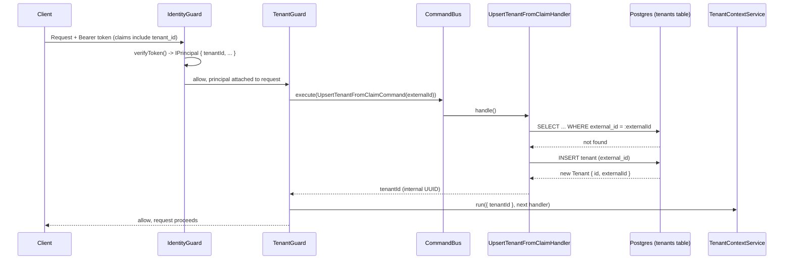
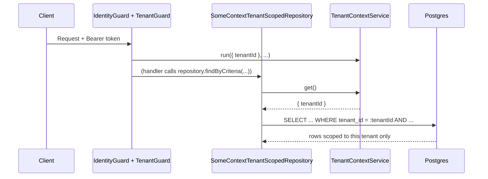

# Design: tenant context + tenancy enforcement

## Split rationale (same shape as identity)

`add-core-identity-module` split into "cross-cutting bridge in `core/`"
(no local aggregate) vs. "business data in `contexts/`" was driven by
whether something persists app-local state. Tenancy has both halves at
once:

- **`Tenant` is real, persisted business data** (an internal id, a link to
  the IdP's tenant claim) → belongs in `src/contexts/tenant/`, this
  template's first bounded context.
- **Enforcing tenant isolation on every request/query is cross-cutting
  infrastructure** every future context needs, the same way
  `IdentityGuard` is → belongs in `src/core/tenancy/`.

`src/core/tenancy/` depends on the `tenant` context's public command
(`UpsertTenantFromClaimCommand`) via `CommandBus`, never by importing its
domain/application directly — same boundary rule the architecture skill
enforces between two bounded contexts, applied here between core and a
context because `core/` must not know `Tenant`'s internal shape.

## `src/contexts/tenant/` layout

```
src/contexts/tenant/
├── domain/
│   ├── aggregates/
│   │   └── tenant.aggregate.ts          — extends BaseAggregate<TenantPrimitives>; create() emits TenantCreatedEvent
│   ├── builders/
│   │   └── tenant.builder.ts            — BaseBuilder; build() returns TenantAggregate
│   ├── events/
│   │   └── tenant-created/tenant-created.event.ts
│   ├── exceptions/
│   │   └── tenant-external-id-already-exists.exception.ts — extends BaseException
│   ├── interfaces/
│   │   └── tenant.interface.ts          — ITenant (id: UuidValueObject, externalId: TenantExternalIdValueObject)
│   ├── primitives/
│   │   └── tenant.primitives.ts         — extends BasePrimitives
│   ├── repositories/
│   │   ├── read/tenant-read.repository.ts   — interface + DI token (Symbol)
│   │   └── write/tenant-write.repository.ts — interface + DI token (Symbol)
│   ├── value-objects/
│   │   └── tenant-external-id/tenant-external-id.vo.ts — StringValueObject subclass, non-empty
│   └── view-models/
│       └── tenant.view-model.ts         — extends BaseViewModel
├── application/
│   └── commands/
│       └── upsert-tenant-from-claim/
│           ├── upsert-tenant-from-claim.command.ts  — UpsertTenantFromClaimCommandInput { externalId: string }
│           └── upsert-tenant-from-claim.handler.ts  — find-or-create by externalId, returns the internal id
├── infrastructure/
│   └── persistence/typeorm/
│       ├── entities/tenant.entity.ts
│       ├── mappers/tenant-typeorm.mapper.ts
│       └── repositories/
│           ├── tenant-typeorm-read.repository.ts
│           └── tenant-typeorm-write.repository.ts
└── tenant.module.ts
```

No `transport/` subtree — this context has no REST/GraphQL/MCP surface in
v1 (see "Out of scope" in `proposal.md`); it's invoked exclusively via
`CommandBus` from `core/tenancy/`'s `TenantGuard`. The architecture skill
explicitly allows dropping any transport subtree a context doesn't need.

No `application/queries/` either: the upsert handler needs "does a Tenant
with this `externalId` exist" as an internal step of a *write* operation,
not as something the app queries independently — it uses
`ITenantWriteRepository` directly (find-or-create in one handler), the
same pattern `assert-{entity}-available` services already follow for
uniqueness checks, just inlined since there's only one caller. A
`tenant-find-by-external-id` query can be added later if something needs
to read a `Tenant` outside this flow — nothing does yet.

**`UpsertTenantFromClaimHandler` returns the aggregate's internal `id`.**
Command handlers in this codebase don't typically return data, but
`TenantGuard` needs that id synchronously, within the same request, to
seed `TenantContextService` — round-tripping through a second `QueryBus`
call for every single request would double the DB round-trips for no
benefit. `CommandBus.execute()` returning a value is supported by
`@nestjs/cqrs` and used narrowly here for that reason.

## `src/core/tenancy/` layout

```
src/core/tenancy/
├── application/
│   └── services/
│       └── tenant-context.service.ts    — AsyncLocalStorage<{ tenantId: string }>; get()/run()
├── infrastructure/
│   ├── guards/
│   │   └── tenant.guard.ts              — reads IPrincipal.tenantId, dispatches UpsertTenantFromClaimCommand, seeds TenantContextService
│   └── persistence/typeorm/
│       └── tenant-scoped.repository.ts  — base class: wraps a QueryBuilder, adds `.andWhere('tenant_id = :tenantId', { tenantId: TenantContextService.get() })`
└── tenancy.module.ts
```

`TenantScopedRepository` is an abstract base a future context's TypeORM
repository extends instead of extending the raw `Repository<Entity>`
pattern directly — e.g. `class OrderTypeOrmReadRepository extends
TenantScopedRepository<OrderEntity>`. It doesn't change the
`IBaseReadRepository`/`IBaseWriteRepository` contract those repositories
already implement; it only changes what the underlying query builder
starts with.

## Decisions

1. **Shared-row isolation (`tenant_id` column), not schema/DB-per-tenant.**
   Simplest to operate, works with the existing single `TypeOrmModule`
   connection and migration pipeline unchanged. Schema/DB-per-tenant would
   require N migration runs and connection-pool-per-tenant — explicitly
   out of scope (see proposal).

2. **Lazy upsert on token verification, not a provider webhook.**
   Cognito has no native tenant/group webhook (would need an external
   Lambda trigger — infrastructure outside this repo); Supabase has Auth
   webhooks; generic OIDC has nothing standard. A lazy upsert triggered by
   `TenantGuard` works identically across all three, keeping `core/`
   provider-agnostic the same way `identity-provider.factory.ts` is. Cost:
   a `Tenant` row is created "empty" (just its `externalId`) the first
   time someone from it logs in, rather than the moment an admin
   provisions it in the IdP — acceptable since there's no tenant admin
   surface in this template anyway yet.

3. **`TenantGuard` runs after `IdentityGuard`, mirroring `RolesGuard`.**
   It reads `request[REQUEST_PRINCIPAL_KEY]` the same way `RolesGuard`
   does (via `IdentityGuard`'s exported `getPrincipal()`/`getRequest()`
   helpers) rather than re-deriving anything from the raw token. Ordering
   is enforced by convention (`@UseGuards(IdentityGuard, TenantGuard,
   RolesGuard)`), same as `RolesGuard` today — Nest guards run in array
   order.

4. **`TenantContextService` uses `AsyncLocalStorage`, not a request-scoped
   provider.** Request-scoped providers force the *entire* dependency
   graph touching them into request scope too (a well-known NestJS
   performance footgun — every provider that transitively depends on a
   request-scoped one gets re-instantiated per request). `AsyncLocalStorage`
   gives the same "current tenant, this request" semantics without that
   cost, and `TenantScopedRepository` (a plain singleton) can read it
   synchronously mid-query.

5. **Opt-in, and dependent on `IDENTITY_PROVIDER`.** `TENANCY_ENABLED=true`
   without `IDENTITY_PROVIDER` set fails fast at boot (there is no
   `IPrincipal` to read `tenantId` from) — validated in
   `env.validation.ts` alongside the existing per-provider checks.

## Sequence: first request from a new tenant



## Sequence: tenant-scoped query in a later request



## Alternatives considered

- **Provider webhook-driven tenant creation** — rejected: uneven support
  across the three providers (see decision 2), and would make tenant
  behavior depend on which `IDENTITY_PROVIDER` is active, breaking the
  "swap providers without touching business code" property the identity
  bridge was built for.
- **Request-scoped `TenantContextService` provider** — rejected in favor
  of `AsyncLocalStorage` (see decision 4).
- **Schema-per-tenant** — rejected for v1 (see decision 1); the
  `TenantScopedRepository` abstraction is designed so a service that
  outgrows shared-row isolation can swap the base class's query-building
  strategy later without changing every context's repositories again.

## Follow-ups (explicitly out of scope here)

- Tenant admin operations (suspend, rename, delete, list).
- A `tenant-find-by-external-id` query, if some future context needs to
  read tenant data directly instead of only through `TenantContextService`.
- Provider-specific webhook sync, if lazy-upsert's "empty until first
  login" behavior turns out to be insufficient for some service.
- The `users` bounded context — designed to reference `Tenant.id`, not
  built here.
