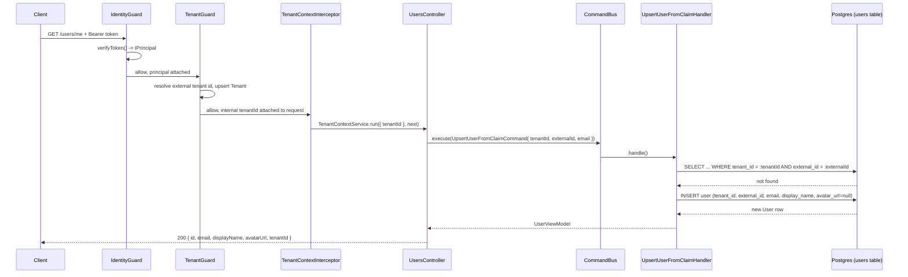
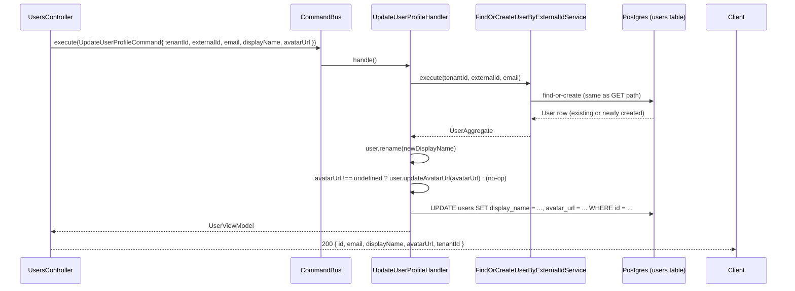

# Design: users context

## Split rationale

Unlike tenancy, this one doesn't split across `core/` and `contexts/` —
there is no cross-cutting infrastructure piece here. "Resolve or create
the caller's own `User` row" is a concern of exactly one context (`users`
itself, exercised by exactly one controller, `/users/me`), not something
every future bounded context needs the way tenant scoping is. So the
whole thing lives in `src/contexts/users/`. See "Why not a `UserGuard`"
below for the design decision that follows from this.

## `src/contexts/users/` layout

```
src/contexts/users/
├── domain/
│   ├── aggregates/
│   │   └── user.aggregate.ts             — extends BaseAggregate<UserPrimitives>; create() emits UserCreatedEvent
│   ├── builders/
│   │   └── user.builder.ts               — BaseBuilder; build() returns UserAggregate
│   ├── events/
│   │   └── user-created/user-created.event.ts
│   ├── exceptions/
│   │   └── user-not-found.exception.ts   — extends BaseException
│   ├── interfaces/
│   │   └── user.interface.ts             — IUser (id, tenantId, externalId, email, displayName, avatarUrl — all VOs)
│   ├── primitives/
│   │   └── user.primitives.ts            — extends BasePrimitives
│   ├── repositories/
│   │   ├── read/user-read.repository.ts  — interface + DI token (Symbol)
│   │   └── write/user-write.repository.ts — interface + DI token (Symbol); findByExternalId(tenantId, externalId)
│   ├── value-objects/
│   │   ├── user-id/user-id.vo.ts         — UuidValueObject subclass
│   │   ├── user-tenant-id/user-tenant-id.vo.ts   — UuidValueObject subclass; THIS context's own reference type
│   │   ├── user-external-id/user-external-id.vo.ts — StringValueObject subclass, non-empty
│   │   └── user-display-name/user-display-name.vo.ts — StringValueObject subclass, non-empty, max length
│   │       (`email`/`avatarUrl` use nestjs-kit's `EmailValueObject`/`UrlValueObject` directly — no local
│   │       subclass needed, both are nullable fields rather than nullable VOs)
│   └── view-models/
│       └── user.view-model.ts            — extends BaseViewModel
├── application/
│   ├── commands/
│   │   ├── upsert-user-from-claim/
│   │   │   ├── upsert-user-from-claim.command.ts   — { tenantId, externalId, email }
│   │   │   └── upsert-user-from-claim.handler.ts   — find-or-create by (tenantId, externalId); re-syncs email; returns UserViewModel
│   │   └── update-user-profile/
│   │       ├── update-user-profile.command.ts — { tenantId, externalId, email, displayName, avatarUrl? }
│   │       └── update-user-profile.handler.ts — find-or-create (same service), then always renames + conditionally updates avatarUrl; returns UserViewModel
│   └── services/
│       └── write/
│           └── find-or-create-user-by-external-id.service.ts  — shared by both handlers, mirrors find-or-create-tenant-by-external-id.service.ts
├── infrastructure/
│   └── persistence/typeorm/
│       ├── entities/user.entity.ts        — tenantId: string property (TenantScopedRepository convention)
│       ├── mappers/user-typeorm.mapper.ts
│       └── repositories/
│           ├── user-typeorm-read.repository.ts   — wraps the injected repository via createTenantScopedRepository()
│           └── user-typeorm-write.repository.ts  — NOT wrapped; every method already takes/carries tenantId explicitly, see the repository's own doc comment
├── transport/
│   └── rest/
│       ├── users.controller.ts            — GET/PATCH /users/me, CommandBus only
│       └── dtos/
│           ├── user-profile-response.dto.ts
│           └── update-user-profile.dto.ts  — { displayName: string; avatarUrl?: string | null }
└── users.module.ts                        — controllers: [] unless IDENTITY_PROVIDER && TENANCY_ENABLED, see decision 6
```

No `application/queries/` beyond what the two commands already return —
same reasoning `add-tenant-context`'s design used for skipping queries on
its own upsert: both `/users/me` verbs need "the current profile, upserted
if needed" as one atomic step, not a separate read after a write. If a
future context needs to look up a `User` independently (not via `/me`), a
`user-find-by-id` query is the natural addition then; nothing needs it yet.

## Decisions

1. **Lazy upsert, mirroring `Tenant`'s.** Same rationale as
   `add-tenant-context` decision 2: no per-provider webhook is reliable or
   uniform across Cognito/Supabase/OIDC, so the first request does the
   work. Difference from `Tenant`: `User` upsert additionally **re-syncs
   `email` on every call** (not just at creation) — `email` is entirely
   IdP-derived and never user-editable, so keeping it stale between token
   refreshes would be a silent correctness bug, not a feature. `Tenant`
   has no analogous synced field (`externalId` never changes once set).

2. **`displayName` default on creation; `avatarUrl` has none.** `displayName`
   defaults to the email's local part (the substring before `@`) when
   `email` is present, otherwise the raw `externalId` — a non-empty,
   reasonable value on the very first request, without forcing every
   client to call `PATCH` before showing anything. `avatarUrl` starts
   `null` instead — there's no equivalent "reasonable guess" for an
   avatar, and a `null` renders fine as "no avatar" client-side. Neither
   default is IdP-derived; both are only ever changed afterward via
   `PATCH /users/me`.

3. **`avatarUrl` is a three-state `PATCH` field; `displayName` isn't.**
   `UpdateUserProfileCommand.avatarUrl` is `UrlValueObject | null |
   undefined`: `undefined` (the request body omitted the key) leaves the
   stored value untouched, `null` clears it, a URL sets it. `displayName`
   doesn't need this — it's always required in the request body and
   always applied, so there's no "leave it as-is" case to represent.
   Chose to generalize the update command to accept both fields rather
   than add a second single-field command, since `PATCH /users/me` was
   always going to accept both in one request body — see "Alternatives
   considered".

4. **Uniqueness is scoped per tenant, not global.** The unique constraint
   is on `(tenant_id, external_id)`, not `external_id` alone. A given IdP
   `sub` is normally globally unique, but nothing in this template
   guarantees every tenant shares one identity pool — scoping the
   constraint to the tenant is strictly safer and costs nothing. A real
   foreign key from `users.tenant_id` to `tenants.id` is added for
   referential integrity (the `tenants` table already exists by the time
   this migration runs, per the dependency on `add-tenant-context`).

5. **Why not a `UserGuard` (the load-bearing decision in this change).**
   `TenantGuard` upserts `Tenant` *inside* a guard because it has a
   genuine bootstrapping problem: the tenant id doesn't exist yet, and
   `TenantContextService` (needed by any `createTenantScopedRepository()`
   -wrapped read) isn't seeded until `TenantContextInterceptor` runs —
   which is *after* guards. `TenantGuard` sidesteps this by never scoping
   `Tenant`'s own repositories this way (a `Tenant` row has no `tenant_id`
   column — it *is* the tenant).

   `User`, by contrast, **does** have a `tenant_id` column, and its read
   repository **is** wrapped via `createTenantScopedRepository()` — which
   means it can only safely run once `TenantContextService` is seeded,
   i.e. from inside the route handler, after `TenantContextInterceptor`
   has already run. Putting the upsert in a `UserGuard` would hit exactly
   the bootstrapping problem `TenantGuard` was built to avoid, one layer
   later: the guard would run before `TenantContextInterceptor`, and any
   scoped read attempted from inside it would throw
   `NoTenantContextException`. (The write repository sidesteps this
   entirely by not using the wrapper at all — every write method already
   carries `tenantId` explicitly — but the read side still needs it, and a
   guard is still the wrong place to run any of this.)

   So `UpsertUserFromClaimCommand` is dispatched from
   `UsersController`'s route handlers themselves (after
   `IdentityGuard` + `TenantGuard` have attached principal/tenant, and
   `TenantContextInterceptor` has seeded `TenantContextService`), not from
   a guard. This is also simpler: nothing outside `/users/me` needs "the
   current user" resolved automatically on every request the way every
   future context needs "the current tenant" — see proposal.md's "Out of
   scope" for the cross-cutting version, deliberately not built now.

6. **`UsersController` registration is gated, unlike `TenantModule`'s
   always-on registration.** `add-tenant-context` could register
   `TenantModule` unconditionally in `CONTEXT_MODULES` because it shipped
   with **no transport surface** — nothing resolves `IdentityGuard`/
   `TenantGuard` at boot just by `TenantModule` being imported. `users`
   is different: its controller declares
   `@UseGuards(IdentityGuard, TenantGuard)`, and Nest resolves a guard's
   own constructor dependencies (`IIdentityProvider` for `IdentityGuard`,
   `CommandBus` for `TenantGuard`) at module-graph-build time regardless
   of whether the route is ever called. `IdentityModule`/`TenancyModule`
   are themselves only imported into `CoreModule` when
   `IDENTITY_PROVIDER`/`TENANCY_ENABLED` are set (`add-core-identity-module`
   decision, `add-tenant-context` decision 5) — so if `UsersController`
   registered unconditionally, **every** service cloned from this template
   with neither flag set would fail to boot the moment `users` existed,
   even though nobody asked for identity, tenancy, or users. That would
   silently break the "opt-in, zero blast radius" guarantee both of those
   proposals were built around.

   Fix: `users.module.ts` reads `IDENTITY_PROVIDER`/`TENANCY_ENABLED` off
   `process.env` at module-array construction time (same pattern
   `core.module.ts` already uses for `IdentityModule`/`TenancyModule`) and
   only includes `UsersController` in its `controllers` array when both
   are set. The context's non-transport providers (commands, repositories)
   still register unconditionally — harmless, mirrors `TenantModule`
   today — only the controller (the piece with the hard guard dependency)
   is conditional.

## Sequence: `GET /users/me`, first request for this user



## Sequence: `PATCH /users/me`

Same guard/interceptor chain as above, then:



## Alternatives considered

- **A `UserGuard` mirroring `TenantGuard` exactly** — rejected, see
  decision 5: it would reintroduce the `AsyncLocalStorage`/
  `TenantScopedRepository` ordering problem `TenantGuard` was specifically
  designed to avoid, one layer later.
- **A cross-cutting `UserContextService` in `src/core/`, resolved on every
  guarded request like `TenantContextService`** — rejected for v1: nothing
  outside `/users/me` needs "the current local user" yet. Listed as a
  follow-up in proposal.md; the upsert command this change adds is
  reusable as-is if that's ever built (a future guard would just dispatch
  the same `UpsertUserFromClaimCommand`).
- **Global unique constraint on `external_id` alone** — rejected in favor
  of `(tenant_id, external_id)`, see decision 4.
- **Unconditional `UsersController` registration** (matching `TenantModule`'s
  pattern) — rejected, see decision 6: `Tenant` had no transport surface
  to make this unsafe; `users` does.
- **A second, single-field `UpdateUserAvatarUrlCommand`** (mirroring the
  original `UpdateUserDisplayNameCommand` shape) instead of generalizing
  one command — rejected: `PATCH /users/me` was always going to accept
  both fields in a single request body, so the controller would have had
  to either dispatch two commands per request or pick one arbitrarily when
  only `avatarUrl` changed. One command with an optional field matches the
  actual HTTP contract more directly; see decision 3.
- **Treating an omitted `avatarUrl` the same as an explicit `null`**
  (i.e., two-state instead of three-state) — rejected: it would make
  "don't touch my avatar" and "remove my avatar" the same request shape,
  forcing every client that only wants to change `displayName` to
  first read back and re-send the current `avatarUrl` just to avoid
  accidentally clearing it.
